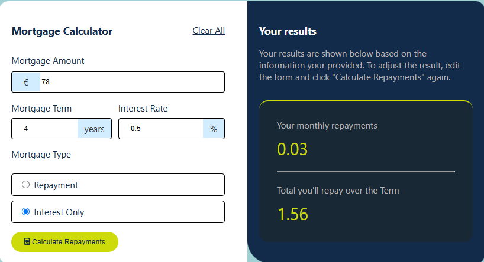

# 🏡 Mortgage Calculator

A lightweight React-based Mortgage Calculator that estimates your monthly mortgage payments based on loan amount, interest rate, and loan term — all updated in real-time as you type.




## ✨ Features

- 🧮 Instant mortgage payment calculation

- 💻 Fully responsive and mobile-friendly UI

- ⚛️ Built using React functional components and hooks

- 📊 Displays total interest and payment breakdown

- ⚡ Real-time updates on input change

## 🌐 Live Demo
Experience the Mortgage Calculator in action:
👉 [View Live on Render](https://mortgagecalculator-kv35.onrender.com/)

## 🎥 Live Walkthrough (Loom Video)
Prefer watching over reading?
Here’s a quick walkthrough of how the mortgage calculator works, recorded via Loom:
👉 [Watch the Loom demo](https://www.loom.com/share/c306ed6c646647a09c52dc2c7405a9e9?sid=664da038-f5c4-48cb-b345-55edf69f7a72)

(Replace the link above with your actual Loom video link when ready)

## 🛠️ Technologies Used  
- **React** (useState, useEffect)  
- **JavaScript (ES6+)**  
- **CSS** (for styling)  

## 📦 Installation  
Follow these steps to set up the project locally:  

1. **Clone the repository:**  
   ```sh
   git clone https://github.com/your-username/mortgagecalculator.git
   cd mortgage-calculator
2. Install dependencies
npm install
3. Start the development server
npm start

## 📌 Usage
1. Enter the loan amount
2. Set the interest rate (%)
3. Choose the loan term (years)
4. Get instant monthly payment calculations

## 🧠 Future Enhancements

- 📅 Add amortization schedule

- 💵 Support for extra payments

- 🌙 Add dark mode

- 📤 Export results as PDF/CSV

- 🤝 Contributing

Contributions are welcome! If you'd like to improve this project:

1. Fork the repository
2. Create a new branch:
  ```sh
git checkout -b feature-branch
```
3. Make changes and commit
```sh
   git commit -m "Add a new feature"
```
4. Push to GitHub and open a pull request:
    git push origin feature-branch

## 📖 Blog Post

Wanna know how this calculator was built under the hood? Check out the full breakdown here 👉
[Read the blog post](https://mugeha585.hashnode.dev/building-a-mortgage-calculator-with-react-a-beginner-friendly-walkthrough)
